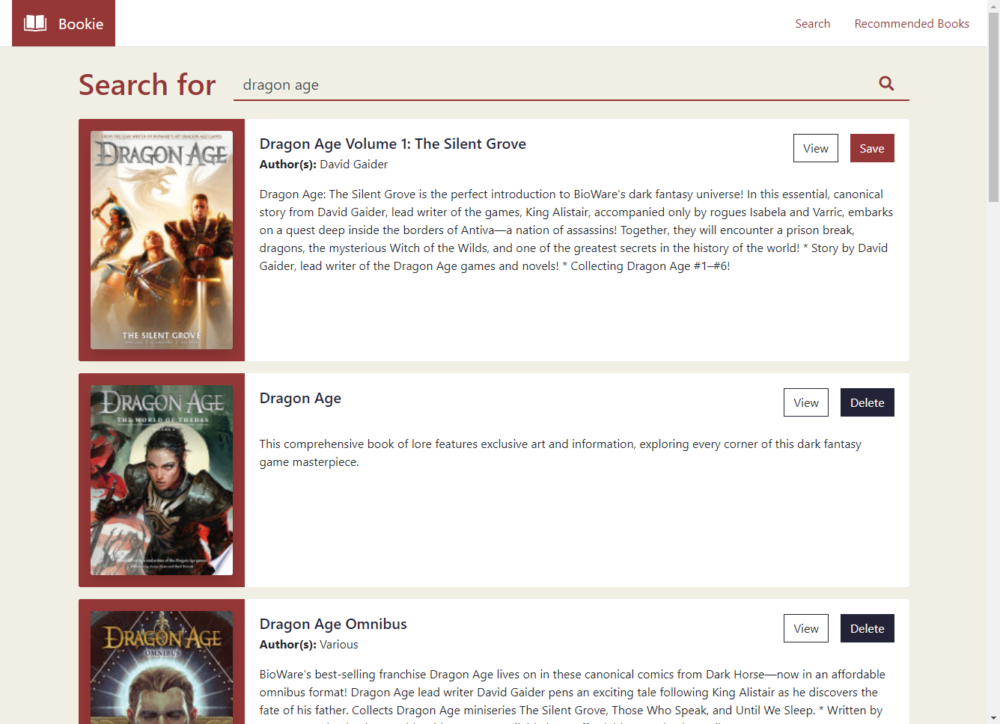

# Bookie



:link: [Visit Bookie](https://bookie-search.herokuapp.com/)

Bookie is a place for book enthusiasts to share their recommendeds. Head to the Search page to look up a book and save it to the list, or go to the Recommended page to see what others have already recommended.


## Purpose

Bookie is practice for creating a CRUD application using React. It uses starter boilerplate code for setting up an Express server and connecting it to the React front-end.

## Starting the app locally

Start by installing front and backend dependencies. While in this directory, run the following command:

```
npm install
```

This should install node modules within the server and the client folder.

After both installations complete, run the following command in your terminal:

```
npm start
```

Your app should now be running on <http://localhost:3000>. The Express server should intercept any AJAX requests from the client.

## Built With

### Front-End

- [React](https://reactjs.org/)

### Back-End

- [Express](https://expressjs.com/)
- [Mongoose](https://mongoosejs.com/)

## License

Bookie is licensed under the **MIT License**.
